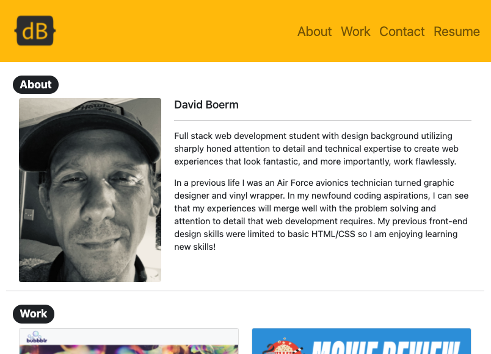
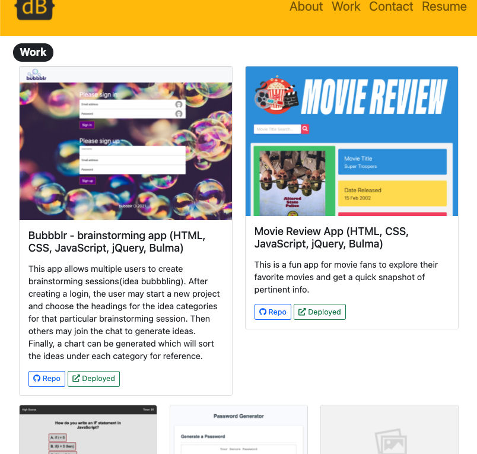
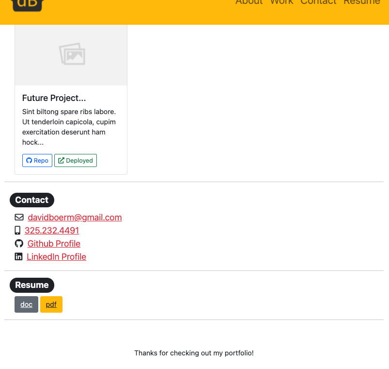

# David Boerm - Dev Portfolio

## Description
  This is my professional portfolio website containing some of my work and how to contact me.
## Screenshots

## Table of Contents
- [Installation](#installation)
- [Usage](#usage)
- [Contributing](#contributing)
- [License](#license)
- [Tests](#test)
- [Questions](#questions)
## Installation
  N/A
## Usage
  N/A
## Contributing
  N/A
## Deployed Link

## License

## Tests
  no tests
## Questions
  Any Questions? Please contact me at one of the following for more information:

  [Github](https://github.com/davidboerm)  
  [LinkedIn](https://www.linkedin.com/in/davidboerm/)  
  [davidboerm@gmail.com](mailto:davidboerm@gmail.com)
